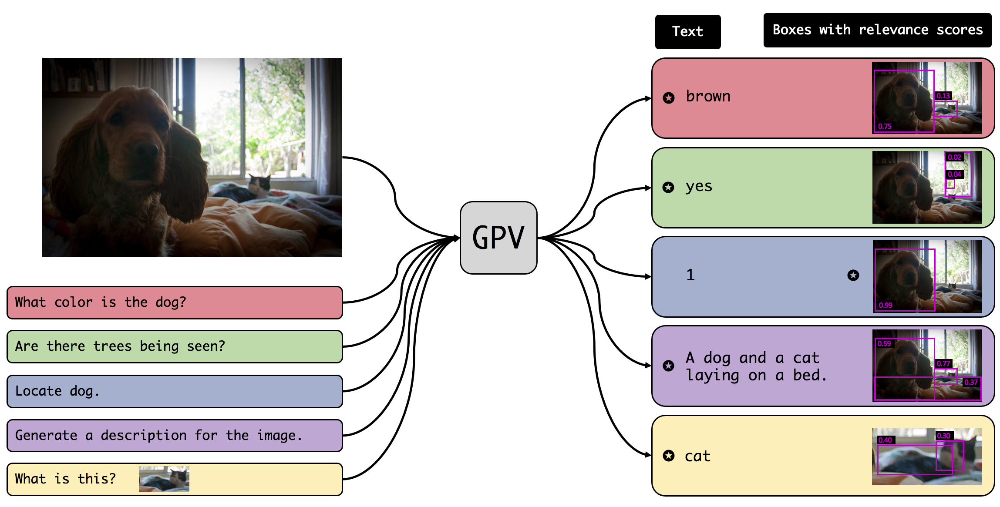

# Towards General Purpose Vision Systems
By [Tanmay Gupta](http://tanmaygupta.info/), [Amita Kamath](https://nlp.stanford.edu/~kamatha/), [Aniruddha Kembhavi](https://anikem.github.io/), and [Derek Hoiem](https://dhoiem.cs.illinois.edu/)



# Overview
This code base contains the extension of GPV-1 to GPV-2 using the T5 + VinVL model.
To clone the repository use:

```
git clone --recurse-submodules git@github.com:chrisc36/gpv.git
```

# Installation
## Code
Create conda environment
```
conda create -n gpv python=3.6 -y
conda activate gpv
```

Next install [pytorch](https://pytorch.org/), I have been using pytorch 1.8.1, 
other versions might work but are not tested. For example:

```
conda install pytorch==1.8.1 torchvision==0.9.1 cudatoolkit=11.1 -c pytorch -c conda-forg
```

but you might need to change that command depending on your operating system/gpu setup.

Finally install libraries:
```bash
bash setup_conda_env.sh
```

## Data
Run:
```bash
bash setup_data.sh 
```

to download the coco data. The script assumes that source data (e.g., images and datasets) should be saved in ~/data/gpv while 
./data-cache can be used to cache things like pre-computed features. 

The web and OpenSCE dataset need to be downloaded manually at the moment.

## Set file paths
The paths in exp/ours/file_paths.py need to be modified to point to the correct locations, it
should not need to be changed if you used the default paths in setput_data.sh.

# Precomputing features for new images
If you want to run the model on a new dataset, you will need to pre-computed the image features
for that dataset. There are three steps to doing this:

1. Gather your images into one directory, it may include subdirectories, but it should not contain any
  files other than images.
2. Run: 
      
    ```
    python exp/ours/image_featurizer/precompute_image_features.py /path/to/image_directory your_dataset_name vinvl.hdf5
    ```
    where `/path/to/image_directory` should point to your image directory and `your_dataset_name` should
    be a name for the set of images you are adding. The script has parameters to control the batch size and run across multiple devices 
    which can be used to tune the process. This will 
    produce the hdf5 file vinvl.hdf5.

3. Move the hdf5 file to `file_paths.PRECOMPUTED_FEATURES_DIR` under a directory with the name our 
    your dataset. For example:
   
    ```
    mkdir data-cache/precomputed-features/your_dataset_name
    mv vinvl.hdf5 data-cache/precomputed-features/your_dataset_name/
    ```

Now the model will support image_ids with the format of `your_dataset_name/path/to/image_file/in/your/directory`. 
For example, if your directory contained the 
image val/dog/001.jpg and your dataset_name was "pets", the image_id "pets/val/001.jpg" will
now be recognized by the model and load the pre-computed features for that image. Image ids of that format 
can now be passed to`run_on_image_id.py` or used in `GPVExample` objects with VinVL models.


# Training
The repo is currently setup to train the basic model on COCO data, optionally with
the addition of web data.

To train on devices 0 and 1 of your machine without web data:

```
python exp/ours/experiments/train_t5.py --device 0 1 --num_workers 3 --task gpv2 --output_dir /path/to/output/dir
```

For debugging purposes I recommend using the --debug flag and reducing the number of devices and 
workers to 0 which will get you much faster startup times and better error messages:

```
python exp/ours/experiments/train_t5.py --device 0 --num_workers 0 --task gpv2 --output_dir /path/to/output/dir --debug small
```

which will run the model on a small sample of the data and without complicated distributed training.

# Eval
The main eval scripts are compute_topn_predictions.py and eval_predictions.py
TODO: More details.